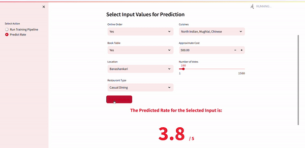

# 📊 Restaurant Rating Prediction App 🚀

This project predicts restaurant ratings using the **Zomato Bengaluru Dataset** from Kaggle. The project implements a robust **MLOps Training Pipeline** in Python 3.12, designed to be modular, scalable, and production-ready.

---


---

---
## 2. Prediction Page


On the **Prediction Page**, accessible via the **"Predict Rate"** button in the sidebar, users can input features to predict restaurant ratings. The input form is split into two sections for ease of use:

### Input Features:
- **Online Order**: Select if the restaurant accepts online orders.
- **Book Table**: Indicate if table booking is available.
- **Location**: Choose the restaurant's location.
- **Restaurant Type**: Specify the type of restaurant.

In another section:
- **Cuisines**: Select the type of cuisines offered.
- **Approximate Cost**: Enter the average cost for two people.
- **Votes**: Adjust the slider to provide the number of votes the restaurant has received.

#### **Important Features**:
The app places a higher weight on features like:
- **Votes**
- **Approximate Cost**
- **Book Table**

These features significantly impact the prediction model's performance.

---

## 3. Prediction Button


After entering the required details, click the **"Predict Rate"** button to get the predicted restaurant rating. The prediction result is displayed clearly, providing actionable insights.

---

### **Key Features**
- **Training and Prediction**: Seamless switching between training and prediction workflows.
- **User-Friendly Interface**: Intuitive and easy-to-use design with a sidebar for navigation.
- **Accurate Predictions**: Designed to emphasize key features like votes and approximate cost for better prediction accuracy.

<h2 align="center">Tools and Technologies Used</h2>
<p align="center">
    &nbsp;&nbsp;&nbsp;
    &nbsp;&nbsp;&nbsp;
    &nbsp;&nbsp;&nbsp;
    &nbsp;&nbsp;&nbsp;
    &nbsp;&nbsp;&nbsp;
    &nbsp;&nbsp;&nbsp;
    &nbsp;&nbsp;&nbsp;
    &nbsp;&nbsp;&nbsp;
    &nbsp;&nbsp;&nbsp;
    &nbsp;&nbsp;&nbsp;
    &nbsp;&nbsp;&nbsp;
    &nbsp;&nbsp;&nbsp;
    
</p>

---

## 🛠️ Step-by-Step Explanation

### 1. **Environment Setup**
- Python 3.12 environment was created to ensure compatibility and scalability.
- Installed all necessary libraries specified in `requirements.txt`.

### 2. **Project Folder Structure**

```plaintext
Restaurant-Rating-Prediction/
│
├── artifacts/                        # Contains all intermediate and final outputs
├── saved_models/                     # Production-ready models and transformers
│
├── Dockerfile                        # Docker image setup
├── docker-compose.yml                # Docker Compose for multi-container setup
│
├── .github/
│   └── workflows/
│       └── main.yaml                 # GitHub Actions CI/CD pipeline
│
|── templates/                        
│     ├── style.css                   # Custom styling for Web App
│     |__ index.html                  # Web application Documentation
│      
|── src/
│   ├── components/                   # Core pipeline components
│   │   ├── data_ingestion.py         # Handles data collection
│   │   ├── data_validation.py        # Validates raw data
│   │   ├── data_transformation.py    # Prepares data for training
│   │   ├── model_training.py         # Trains the machine learning model
│   │   ├── model_evaluation.py       # Evaluates the model
│   │   └── model_pusher.py           # Pushes the trained model to deployment
│   │
│   ├── config.py                     # Configuration management and environment variables
│   ├── logger.py                     # Logging setup
│   ├── utils.py                      # Utility functions
│   ├── entity/                       # Data structures for pipeline
│   │   ├── config_entity.py          # Configuration-related entities
│   │   └── artifact_entity.py        # Artifacts generated by pipeline stages
│   │
│   ├── pipeline/                     # Pipeline automation
│   │   ├── training_pipeline.py      # Automates training workflow
│   │   └── batch_prediction.py       # Handles batch predictions
│   │
│   └── exceptions.py                 # Custom exception handling
│
├── app.py                            # Streamlit app for restaurant prediction
├── main.py                           # Entry point for training and predictions
├── data_dump.py                      # Dumps data into MongoDB Atlas
├── setup.py                          # Package setup for `src`
├── LICENSE                           # MIT License file
├── README.md                         # Project documentation
├── requirements.txt                  # Dependencies for the project
└── research.ipynb                    # Jupyter notebooks for initial analysis
```

---

## Deployment Guide

### **Streamlit App Deployment on EC2 using Docker and GitHub Actions**

This guide provides step-by-step commands to deploy a Streamlit app on an EC2 instance using Docker, with automatic deployment through GitHub Actions.

#### Commands for EC2 Setup and Deployment

1. **Launch an EC2 Instance** using the AWS Management Console with your preferred settings.

2. **Connect to Your EC2 Instance**:

```bash
curl -fsSL https://get.docker.com -o get-docker.sh

sudo sh get-docker.sh

sudo usermod -aG docker ubuntu

newgrp docker
```

#### **GitHub Repo Secrets Setup**

- `AWS_ACCESS_KEY_ID`=
- `AWS_SECRET_ACCESS_KEY`=
- `AWS_REGION`=
- `AWS_ECR_LOGIN_URI`=
- `ECR_REPOSITORY_NAME`=
- `MONGO_DB_URL`=

#### **Run All GitHub Runner Commands in AWS CLI and Activate It**

1. Set Up GitHub Actions Runner on EC2
2. Navigate to **Settings > Actions > Runners** in your GitHub repository.
3. Follow the instructions provided by GitHub to download and configure the runner on your EC2 instance.

```bash
curl -o actions-runner-linux-x64-<version>.tar.gz -L https://github.com/actions/runner/releases/download/v<version>/actions-runner-linux-x64-<version>.tar.gz
tar xzf actions-runner-linux-x64-<version>.tar.gz
```


